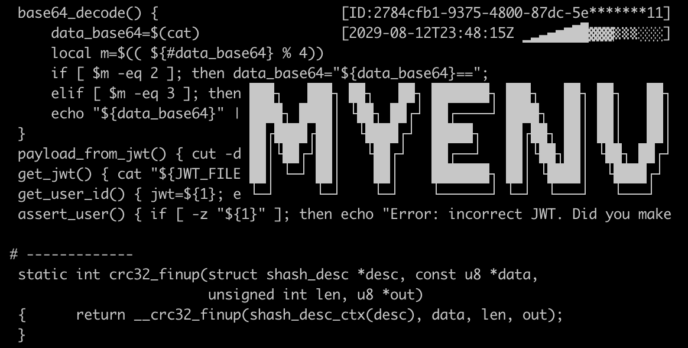

My 📚 notes, 🛠 tools and ⚙️ settings for everyday use.


## Installation

Installation script support OS X and Linux system.

When you need an environment only you can download 
[install-myenv.sh](https://raw.githubusercontent.com/revgen/myenv/master/install-myenv.sh) script and execute it.
Install with wget:
```bash
bash -c "$(wget -qO- https://raw.githubusercontent.com/revgen/myenv/master/install-myenv.sh)"
```
Install with curl:
```bash
bash -c "$(curl -L https://raw.githubusercontent.com/revgen/myenv/master/install-myenv.sh)"
```

When you need an ability to make a changes in the repository:
```bash
$ git clone https://github.com/revgen/myenv.git ~/.local/var/myenv
$ bash ~/.local/var/myenv/install-myenv.sh
```

## Settings

* [MacOS - Settings](https://github.com/revgen/myenv/tree/master/macos/setup)
* [Linux - Settings](https://github.com/revgen/myenv/tree/master/linux/setup)
* [Windows (WSL) - Settings](https://github.com/revgen/myenv/tree/master/wsl/setup)


## Themes, fonts and colors 

### Colors

| Sample |  Html  |      RGB     | Description        |
|:--:|:-----:|:------------:|:-------------------|
|![#191919][color-191919]|#191919|(025,025,025) | Background color   |
|![#283C50][color-283C50]|#283C50|(040,060,080) | Background color   |
|![#619647][color-619647]|#619647|(038,059,028) | Text green color   |


[color-191919]: http://dummyimage.com/32x32/191919/191919.png
[color-283C50]: http://dummyimage.com/32x32/283C50/283C50.png
[color-619647]: http://dummyimage.com/32x32/619647/619647.png
